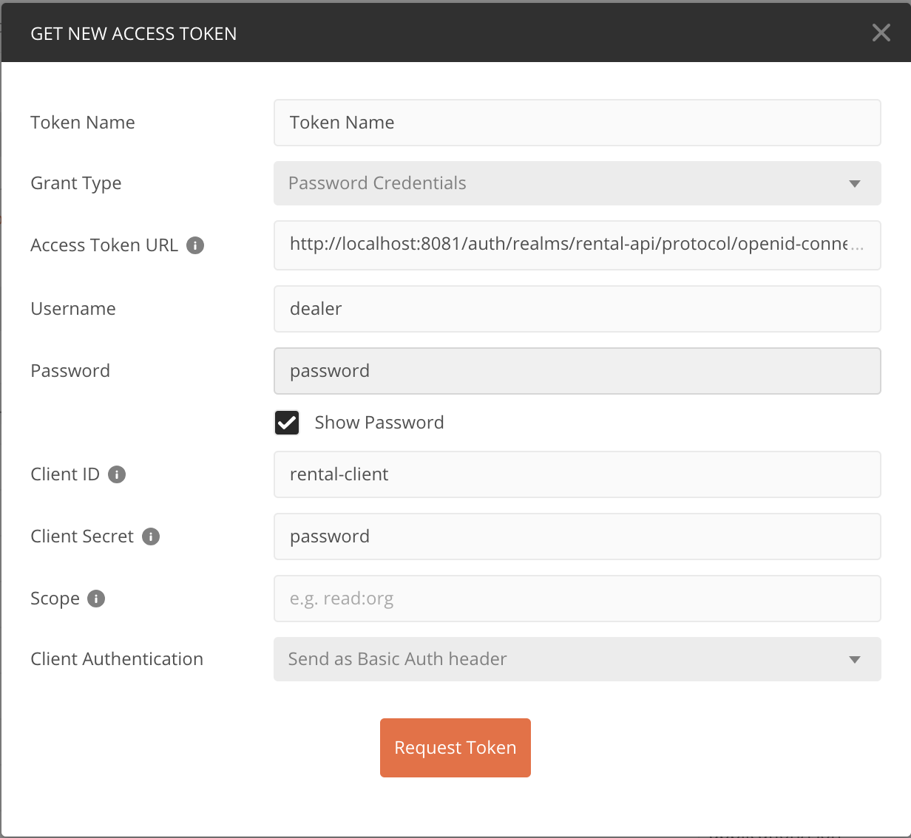

# Assignment

The goal of this assignment is to build a simple first version of a **Lease-a-car API**. The **Lease-a-car API** should be built according the microservices principles.

## Lease-a-car API

The **Lease-a-car API** is REST API which allows to maintain vehicle versions, customers and other data needed to service a broker.

The end-users of the **Lease-a-car API** are:

- Brokers which calculate the leaserate for a customer, and maintain customer data.
- Leasing company which maintains data to make a accurate calculation.

### Functional Requirements

The **Lease-a-car API** has the following _functional requirements_:

- You can maintain (add, change and delete) a customer. (Name, street, housenumber, zipcode, place, email, phonenumber)
- You can maintain basic cardata attributes
    - Make
    - Model
    - Version
    - Number of Doors
    - CO2-emission
    - Gross price
    - Nett price
- The leaserate is depending on the following parameters:
    - Mileage, the amount of kilometers on annual base
    - Duration of the contract in months
    - Interest rate w/ startdate
    - Nett price
- Leaserate = ((( mileage / 12 ) * duration ) / Nett price) + ((( Interest rate / 100 ) * Nett price) / 12 )
- Example calculation:
    - Mileage: 45000 km/yr
    - Duration: 60 mnths
    - Interest rate: 4.5%
    - Nett Price: € 63000
    - **Leaserate: € 239,76 per mnth**
- The broker and employees who keep track of the data must log into the API before any subsequent call can be made.
- The identity should be validated every call.

### Project outline

- The project was built in a contract-first manner, the public API 
and models are defined in `resources/contract.yml` 
- The API interface and models are generated
- Swagger UI is accessible from `http://localhost:8080/swagger-ui.html`
- jacoco coverage reports can be found at `build/jacoco-reports`
- Integration tests use the Cucumber framework, feature files are in `src/test/resources`
- Authentication is via Oauth2 using Keycloak as auth server
- In mempory H2 databse is used
- Running the application in mock mode populates the database with vehicles annd clients
- Clients data have been randomly generated by [www.fakenamegenerator.com](www.fakenamegenerator.com)
  
## Startup guide

Create a `.env` file in the root of the project and populate it with the users and passwords or supply them in the VM as you want:
```
MYSQL_ROOT_PASSWORD=
MYSQL_USER=
MYSQL_PASSWORD=

KEYCLOAK_DB=
KEYCLOAK_USER=
KEYCLOAK_PASSWORD=
KEYCLOAK_SECRET=password
```

* Please make sure your firewall allows the build to download the embedded mongodb binaries for tests!
* build the project with gradle `gradle build`
* Start the services with `docker-compose -f docker-compose-services.yml up` (THIS NEEDS TO BE DONE before the app!)
* start the application by either `java -jar build/libs/car-rental-api-0.0.1-SNAPSHOT.jar --spring.profiles.active=local,mock`
* check `http://localhost:8080/swagger-ui.html` for available endpoints
* import `src/main/resources/contract.yml` to PostMan
* Get the Oauth token with below details

### Oauth
* Realm: `rental-api`
* Client ID: `rental-client`
* password: `password` (This has to be changed at first logon to Keycloak)
* access token url: `http://localhost:8081/auth/realms/rental-api/protocol/openid-connect/token`

